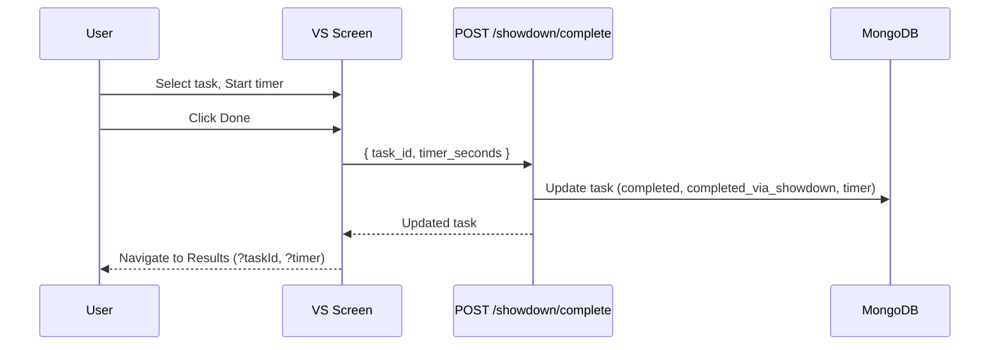
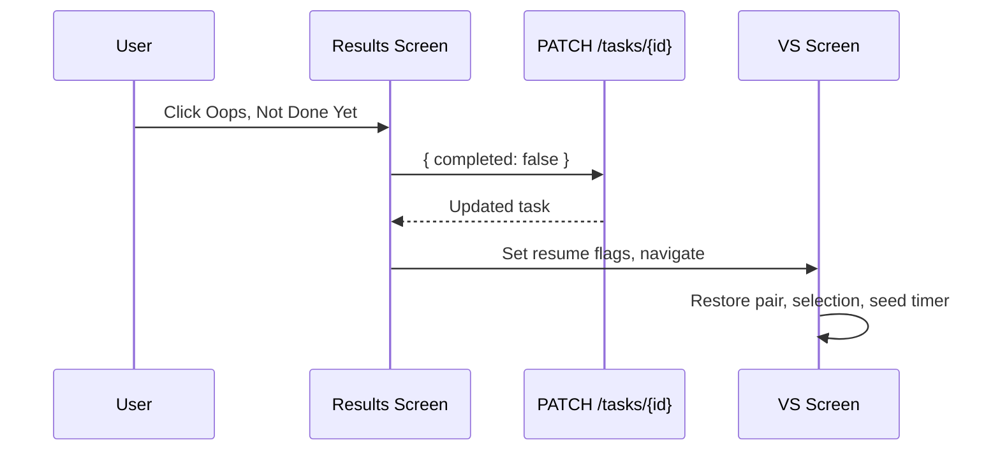

# Procrastination Showdown - System Overview

This document explains the architecture, data model, API, UI flows, pairing and ranking logic, and testing approach for the Procrastination Showdown feature.

## High-level Architecture

```mermaid
flowchart TD
  subgraph FE[Frontend - Next.js (App Router)]
    DASH[/Dashboard/]
    VS[/Showdown VS/]
    RANK[/Showdown Rank/]
    RESULTS[/Showdown Results/]
    Auth[AuthContext]
    Theme[ThemeContext]
  end

  subgraph BE[Backend - FastAPI]
    AuthAPI[/auth/*/]
    TaskAPI[/tasks/*/]
    LabelAPI[/labels/*/]
    ShowdownAPI[/showdown/*/]
  end

  DB[(MongoDB tasks, labels, users)]

  DASH --> VS
  DASH --> RANK
  VS -->|GET /showdown/pair| ShowdownAPI
  VS -->|POST /showdown/complete| ShowdownAPI
  VS -->|GET /labels, GET /tasks| TaskAPI
  RANK -->|GET /tasks| TaskAPI
  RANK -->|PATCH /tasks/:id dislike_rank| TaskAPI
  RESULTS -->|PATCH /tasks/:id completed=false (undo)| TaskAPI

  ShowdownAPI --- DB
  TaskAPI --- DB
  LabelAPI --- DB
  AuthAPI --- DB
```

## Core Data Model

- Task (Mongo document)
  - title: string
  - description: string | null
  - priority: enum("high"|"medium"|"low")
  - deadline: datetime (tz-aware)
  - completed: boolean
  - label_ids: ObjectId[]
  - dislike_rank: int (>= 0, default 0)
  - showdown_timer_seconds: int | null
  - completed_via_showdown: boolean
  - user_id: ObjectId, created_at, updated_at

- Label (Mongo document)
  - name: string
  - color: string (hex)
  - user_id: ObjectId

- User (Mongo document)
  - email, password_hash, etc.

## API Endpoints

- Auth
  - POST /auth/signup -> sets httpOnly access_token cookie
  - POST /auth/login -> sets httpOnly access_token cookie
  - GET /auth/me
  - POST /auth/logout

- Tasks
  - GET /tasks
  - GET /tasks/{id}
  - POST /tasks
  - PATCH /tasks/{id}
  - DELETE /tasks/{id}

- Labels
  - GET /labels, POST /labels, PATCH /labels/{id}, DELETE /labels/{id}

- Showdown
  - GET /showdown/pair
    - Query: last_a, last_b (avoid immediate repeat), avoid_high (hint to rotate the dreaded task)
    - Returns 2 incomplete tasks
  - POST /showdown/complete
    - Body: { task_id: string, timer_seconds?: number }
    - Marks task complete, sets completed_via_showdown, saves timer seconds

## Frontend Flows

### Dashboard -> Showdown
- Dashboard shows a CTA to start Showdown if the user has >= 4 active tasks.
- CTA navigates to VS.

### VS (Versus) Screen
- Fetch a pair from GET /showdown/pair.
  - Pass last pair (last_a, last_b) and avoid_high to reduce immediate repeats and rotate the high-dislike slot.
- Two task cards with title, truncated description, priority badge, due date, and label chip.
- Selection visuals (ring/scale) and animated completion check for the selected card.
- Optional timer: Start/Pause/Done.
  - Done stops the timer, posts to /showdown/complete, then navigates to Results with time in the query string.
- Undo/Resume:
  - Results -> Oops Not Done Yet sets completed=false and stores a resume flag.
  - VS restores the previous pair/selection and seeds timer from saved seconds (can resume).
- Guard modals:
  - Switching selection with time -> confirm clearing timer.
  - Picking new showdown with time -> confirm clearing timer.
- Gating: if < 4 active tasks, show a notice and Return to Dashboard button.

### Results Screen
- Shows celebration with completed task title and time (if used).
- Oops Not Done Yet -> PATCH /tasks/{id} { completed: false }, sets resume state, and returns to VS.

### Ranking Screen
- 8 pairwise comparisons to seed/refine dislike_rank.
- Prefer pairing one "unranked" (dislike_rank + session delta <= 0) with one ranked task.
- If all tasks are ranked, cycle among ranked tasks for refinement.
- Persist dislike_rank via PATCH /tasks/{id}. Completion modal offers Start Showdown or Rank More.

## Pairing Logic (Backend)

Goal: pit a highly disliked task against a mildly disliked task to leverage avoidance.

- Start with all incomplete tasks sorted by dislike_rank desc.
- High bucket ~40% (min 2 when n >= 4, max 5), shuffled.
  - If avoid_high matches the first candidate and there is an alternative, choose another to rotate the dreaded task.
- Low bucket from lower half; shuffle and sample a small subset proportional to pool size.
  - Choose the first candidate that is different from high and not the immediate last pair.
- If all ranks equal: pick two random distinct tasks and retry a few times to avoid the immediate last pair.
- Avoid immediate repeat: last_a/last_b are treated as an unordered set.

Rationale:
- Ensures contrast and increasing variety as pool size grows.
- Reduces "sticky" pairs in small sets.

## Sequence Diagrams

### Completion with Timer


### Undo (Not Done Yet)


## Configuration & Runtime

- Env vars
  - Frontend: NEXT_PUBLIC_API_BASE_URL must match the host you browse to.
  - Backend: JWT_SECRET, JWT_ALG, JWT_EXPIRE_MIN, MONGO_URI, MONGO_DB_NAME_DEV/TEST/PROD.
- CORS: backend allows localhost and 127.0.0.1 with credentials; SameSite=Lax cookie.

## Testing Strategy

- Cypress
  - Phase 1: MVP flow (dashboard -> VS -> complete -> results -> dashboard).
  - Phase 2: ranking -> VS pairing via endpoint -> timer Done persistence -> results -> undo resume to VS.
- Pytest
  - Pairing contrast/no immediate repeat test seeds tasks and asserts behavior.

## Future Enhancements

- Ranking depth: move to Elo/Bradley–Terry, track pair counts, minimum comparisons per task.
- Pairing diversity: keep a short rolling window of recent pairs server-side for added variety.
- Stats & streaks: aggregate per-user stats (tasks completed via showdown, time invested, streak days).
- Accessibility & UX: respect reduced motion, focus states, ARIA labels for buttons and modals.
